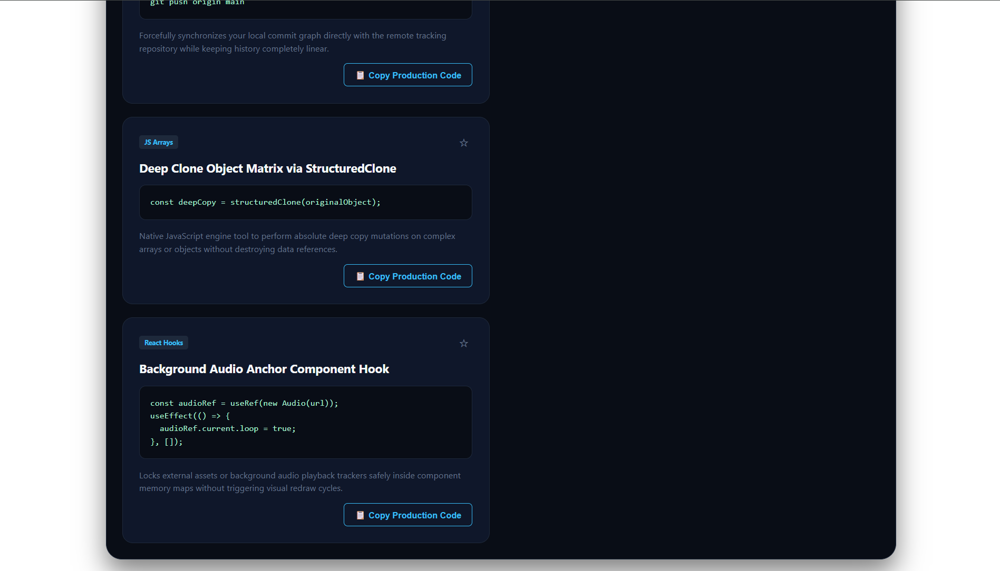

#  DocuSearch — Technical Snippet Command Center & Search Indexer
-------------------------------------------------------------------------

DocuSearch is an asynchronous documentation utility engineered with React. It drives an optimized compound search algorithm capable of filtering objects across multiple properties simultaneously, utilizing local browser storage registers to maintain user reference vault anchors.

## Preview
----------------------------------------------------

##  Technical Highlights
-----------------------------------------------

*  **Compound Multi-Property Tokenization:** Performs real-time scanning filters across array objects by checking titles, text code syntax parameters, and explanation text fields inside single execution loops.
*  **Dynamic Clipboard Processing:** Synthesizes raw text template strings from data objects to fire native system clipboard mutations without layout flickering.

##  Running Instructions
--------------------------------------------------

1. Install packages: `npm install`
2. Run ecosystem: `npm run dev`

----------------------------------------------------
